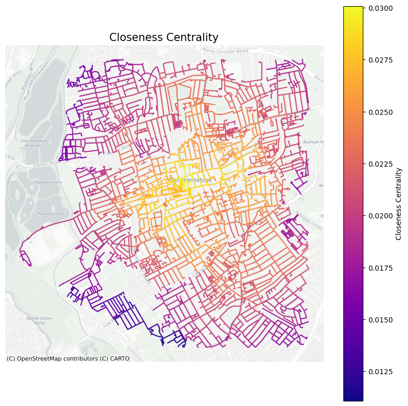
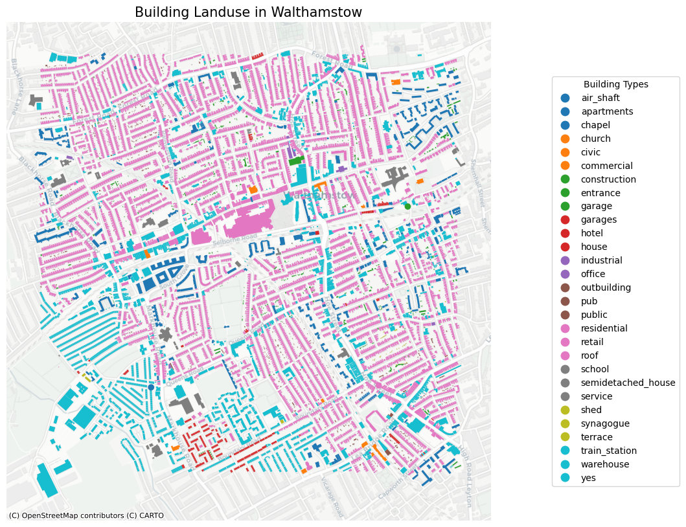

```python
# imports the various library for the lab
import numpy as np
import pandas as pd
import matplotlib
import matplotlib.pyplot as plt
import osmnx as ox # this line imports osmnx
import networkx as nx # this line imports networkx
import matplotlib.cm as cm
import matplotlib.colors as colors
#from IPython.display import IFrame
#ox.config(log_console=True, use_cache=True)

import sys
print (f'current environment: {sys.prefix}')

if ox.__version__=='2.0.1':
    #prints OSMNx version 
    print (f'current osmnx version: {ox.__version__}') 
else:
    #recommends student to upgrade to newer osmnx version.
    print (f'current osmnx version: {ox.__version__}. student might need to upgrade to osmnx=2.0.1 for the notebook to work')
```

    current environment: /opt/anaconda3/envs/envGEOG0051
    current osmnx version: 2.0.1


```python
# Select a neighbourhood of London you know well and get the graph in osmnx with a radius of 2000m

G=ox.graph_from_address('Walthamstow, London', dist=2000, network_type='walk')

```


```python
# This converts G (a MultiDiGraph) into a DiGraph (a directed graph without multiple edges between nodes).
DG = ox.convert.to_digraph(G)
```


```python
# Run a street network analysis for a neighbourhood in London: closeness centrality

edge_bc = nx.closeness_centrality(nx.line_graph(DG))
nx.set_edge_attributes(DG, edge_bc,'cc')
```


```python
# Run a street network analysis for a neighbourhood in London: degree centrality

edge_dc = nx.degree_centrality(nx.line_graph(DG))
nx.set_edge_attributes(DG, edge_dc,'dc')

```


```python
# Run a street network analysis for a neighbourhood in London: betweenesss centrality

edge_dc = nx.betweenness_centrality(nx.line_graph(DG))
nx.set_edge_attributes(DG, edge_dc,'bc')
```


```python
#turn it into a multi-graph
G1 = nx.MultiGraph(DG)
```


```python
# convert graph to geopandas dataframe
gdf_edges = ox.graph_to_gdfs(G1,nodes=False,fill_edge_geometry=True)

# set crs to 3857 (needed for contextily)
gdf_edges = gdf_edges.to_crs(epsg=3857) # setting crs to 3857

# plot edges according to closeness centrality
ax=gdf_edges.plot('cc',cmap='plasma',figsize=(10,10),legend=True,
                     legend_kwds={'label': "Closeness Centrality", 'orientation': "vertical"})

# add a basemap using contextilly
import contextily as ctx
ctx.add_basemap(ax,source=ctx.providers.CartoDB.Positron)
plt.axis('off')
plt.title ('Closeness Centrality', fontsize=15)

plt.savefig('cc.png', bbox_inches='tight', dpi=300)

plt.show()
```


    

    


```python
# convert graph to geopandas dataframe
gdf_edges = ox.graph_to_gdfs(G1,nodes=False,fill_edge_geometry=True)

# set crs to 3857 (needed for contextily)
gdf_edges = gdf_edges.to_crs(epsg=3857) # setting crs to 3857

# plot edges according to degree centrality
ax=gdf_edges.plot('dc',cmap='plasma',figsize=(10,10),legend=True,
                     legend_kwds={'label': "Degree Centrality", 'orientation': "vertical"})

# add a basemap using contextilly
import contextily as ctx
ctx.add_basemap(ax,source=ctx.providers.CartoDB.Positron)
plt.title ('Degree Centrality', fontsize=15)
plt.axis('off')

plt.savefig('dc.png', bbox_inches='tight', dpi=300)
plt.show()
```


    

    


```python
# convert graph to geopandas dataframe
gdf_edges = ox.graph_to_gdfs(G1,nodes=False,fill_edge_geometry=True)

# set crs to 3857 (needed for contextily)
gdf_edges = gdf_edges.to_crs(epsg=3857) # setting crs to 3857

# plot edges according to betweeness centrality
ax=gdf_edges.plot('bc',cmap='plasma',figsize=(10,10),legend=True,
                     legend_kwds={'label': "Betweeness Centrality", 'orientation': "vertical"})

# add a basemap using contextilly
import contextily as ctx
ctx.add_basemap(ax,source=ctx.providers.CartoDB.Positron)
plt.title ('Betweeness Centrality', fontsize=15)
plt.axis('off')


plt.savefig('bc.png', bbox_inches='tight', dpi=300)
plt.show()
```


    

    


```python
#Run a street network analysis for a neighbourhood in London: land use
```


```python
ox.io.save_graph_geopackage(G)
```


```python
# you can get the geometries of a place similar to getting a graph 
tags= tags={'amenity': True, 'highway':True, 'landuse':True, 'building':True, 'waterway': True, 'railway': True}
all_geom=ox.features_from_address('Walthamstow, London', tags, dist=1000)
all_geom = all_geom.to_crs(epsg=3857)
```


```python
fig,ax = plt.subplots(figsize=(10,10))
all_geom[all_geom['landuse'].notna()].plot(ax=ax,color='black')
import contextily as ctx
ctx.add_basemap(ax,source=ctx.providers.CartoDB.Positron)
plt.axis('off')
plt.show()
```


    

    


```python
fig,ax = plt.subplots(figsize=(10,10))
all_geom[all_geom['building'].notna()].plot('building',
                                            ax=ax,
                                            categorical=True,
                                            legend=True)
import contextily as ctx
ctx.add_basemap(ax,source=ctx.providers.CartoDB.Positron)
plt.axis('off')
plt.show()


```


    

    


```python
fig, ax = plt.subplots(figsize=(10,10))

# Plot buildings with a legend
plot = all_geom[all_geom['building'].notna()].plot('building',
                                                   ax=ax,
                                                   categorical=True,
                                                   legend=True)

# Move legend outside the map
leg = ax.get_legend()
leg.set_bbox_to_anchor((1.4, 0.9))  # Moves legend outside (right side)
leg.set_title("Building Types")  # Optional: Add a title

# Add basemap
ctx.add_basemap(ax, source=ctx.providers.CartoDB.Positron)

plt.axis('off')  # Remove axes

plt.title ('Building Landuse in Walthamstow', fontsize=15)
plt.savefig('landuse.png', bbox_inches='tight', dpi=300)
plt.show()

```


    

    


```python
fig, ax = plt.subplots(figsize=(10, 10))

# Filter only university buildings
retail = all_geom[(all_geom['building'].notna()) & (all_geom['building'].str.contains('retail', case=False, na=False))]

# Plot universities
retail.plot(ax=ax, color='red', edgecolor='black', alpha=0.7, legend=True)

# Add basemap
ctx.add_basemap(ax, source=ctx.providers.CartoDB.Positron)

plt.axis('off')
plt.title("Retail Buildings")
plt.show()
```


    

    


```python
#Run a street network analysis for a neighbourhood in London: shortest path analysis

```


```python
retail = ox.geocode("retail")

print(retail)
```

    (7.4892035, 80.36586176310229)


```python
tottenham = ox.geocode("Tottenham, London")

print(tottenham)
```

    (51.5881223, -0.0599366)


```python

origin_point = [51.5815237, -0.0237594] #trafalgar square
destination_point = [51.5881223,-0.0599366] #covent garden
origin_node = ox.nearest_nodes(G, origin_point[1],origin_point[0])
destination_node = ox.nearest_nodes(G, destination_point[1],destination_point[0])
origin_node, destination_node 


# find the shortest path between origin and destination nodes
route = nx.shortest_path(G, origin_node, destination_node, weight='length')
str(route)

# plot the route showing origin/destination lat-long points in red
fig,ax = ox.plot_graph_route(G, route )
```


    

    


```python
Research Question: Identifying the most optimal location for a cafe in Walthamstow

Café Nero is opening a cafe in Walthamstow. This project seeks to identify the most optimal location for the cafe to maximise footfall. 
OSMnx was utilised to obtain a graph of Walthamstow with a 2000m radius. This graph was used to explore closeness centrality, degree centrality, betweenness centrality and land use. 

Figure 1 shows that Walthamstow Central has the greatest closeness centrality, indicating that Walthamstow Central is a highly accessible location. 
This is expected as the London Overground and Underground stations are situated in this location. Similarly, Figure 2 shows that Walthamstow Central has a high degree centrality, suggesting that this node is directly connected to many other nodes.
By contrast, Figure 3 reveals that Walthamstow Central does not have a high betweenness centrality. Figure 3 evidences high betweenness centrality on Hoe Street. This suggests that this node acts as an intermediary in the shortest path between other nodes. 

Therefore, it can be suggested that Café Nero ought to locate a coffee shop around Selborne Road as there is a high closeness centrality and a high degree centrality at this node. 
As this node is highly accessible and can be directly reached by many other nodes, it means that people are more likely to visit the cafe as it is conveniently placed.
As well as this, Selborne Road is adjacent to Hoe Street which means it will have high visibility which is likely to yield greater footfall. Figure 4 confirm this argument as retail shops and train stations are located on Selborne Road.


```
